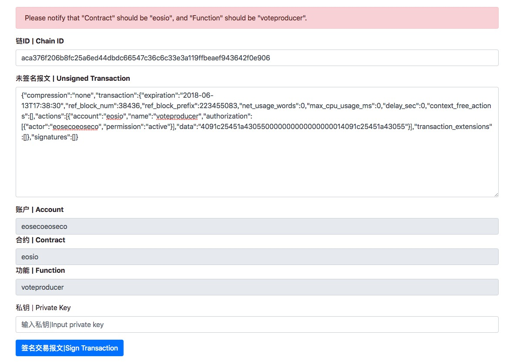
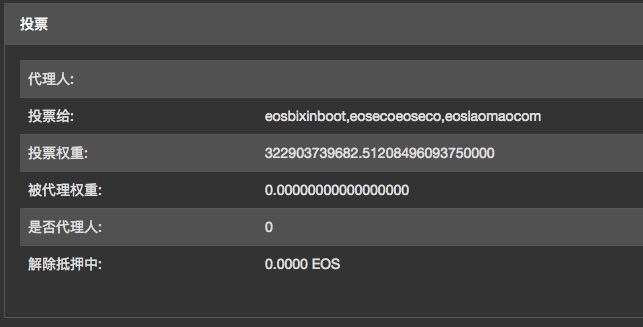

# EOS 离线投票工具 | EOS Offline Voting Tool | EOSeco出品

## EOSeco 超级节点账户 | BPC account name ：eosecoeoseco

EOS 已经上线，但是很多用户苦于没有放心的钱包不能投票。EOSeco 推出了离线投票工具，可以完全在离线的环境下使用，保证用户私钥的安全。整个投票流程分为3个步骤：

EOS Offline Voting Tool can be use offline for safty reason.

## 1 生成交易 | Generate Transaction

这个步骤需要在线完成。

This step go online.

访问 EOSeco区块链浏览器的投票界面：
[EOSeco投票排行](https://explorer.eoseco.com/voting)

Visit EOSeco explorer voting page :
[EOSeco Voting](https://explorer.eoseco.com/voting)

勾选希望投票的超级节点，默认会把EOSeco勾选上，如果你一定不投我们的话，可以取消勾选，最多不能选择超过30个。

click BPCs you want, no more than 30.

然后输入你的用户名，点击生成交易，然后点击复制待签名交易。这里设定该交易报文的失效时间为半小时，应该足够用户进行操作了。

Input your account name , click to generate transaction, and copy it.

## 2 签名交易 | Signing Transaction

这个步骤需要用到私钥，强烈建议离线完成。

This step need private key, strongly recommend offline operation.

下载最新版本的EOSeco [离线签名工具]()。

Download latest version of  [Offline Signing Tool]().

将第一步中生成的待签名交易报文复制进来，确认账户正确，然后输入私钥，点击签名交易报文。

Paste unsigned transaction in step #1, make sure account name is right, then type in private key and click Sign Transaction.

点击将已签名交易复制出来。到这一步唯一使用私钥的场景完毕，你可以关闭页面，重新上网。

Copy signed transaction, and close page. Now you can go online.

## 3 发送报文 | Send Transaction

访问 EOSeco区块链浏览器的发送报文界面：
[EOSeco发送交易](https://explorer.eoseco.com/sending)

Visit EOSeco explorer sending page:
[EOSeco Sending](https://explorer.eoseco.com/sending)

将第二步签名好的交易复制进来，点击发送。

Paste signd transaction, and click send transaction.

不出意外你就可以在EOSeco浏览器查看你的账号，是不是投票成功了。

Now you can see your voting transaction.

希望大家能够帮忙宣传 EOSeco 生态区，我们深度参与了EOS主网启动，以后也会持续为社区做贡献。

Hope you guys vote us , EOSeco.

